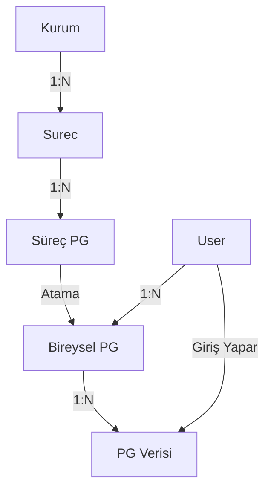

# Sistem ve İş Mantığı Doğrulama Raporu

**Tarih:** 04.01.2026
**Hazırlayan:** Antigravity (Otonom İş Analisti & QA Mühendisi)
**Durum:** ✅ Doğrulandı

## 1. Yönetici Özeti
Bu rapor, sistemin iş mantığı bileşenlerinin keşfi, kavramsal analizi ve uçtan uca fonksiyonel test sonuçlarını içerir. Yapılan otonom analizler sonucunda, **"PG" (Performans Göstergesi)** yapısının sistemin temel yapı taşlarından biri olduğu ve PostgreSQL veritabanı ile ilgisi olmadığı, tamamen iş süreçlerinin performans takibi için tasarlandığı doğrulanmıştır.

Sistem; Süreç, Hedef, Performans Göstergesi (PG) ve Faaliyet takibi üzerine kurulu sağlam bir veri modeline sahiptir. Admin ve Kullanıcı rolleri arasındaki veri izolasyonu ve iş akışı başarıyla test edilmiştir.

---

## 2. Kavramsal Keşif ve Bileşen Haritası

Sistem dosyaları (`models/`) taranarak aşağıdaki ana bileşenler ve ilişkileri tespit edilmiştir:

### 2.1. Ana Bileşenler
*   **Süreç (Surec):** Kurumun ana iş birimi. (Örn: Pazarlama, İK).
    *   *Dosya: `models/process.py`*
*   **PG - Süreç Performans Göstergesi (SurecPerformansGostergesi):** Bir sürecin başarısını ölçen metrikler.
    *   *Örn:* Müşteri Memnuniyet Oranı, Satış Adedi.
    *   *Önemli:* "PG" kısaltması kod içinde `kodu` alanında (örn: PG-01) ve veri modellerinde aktif olarak kullanılmaktadır.
*   **Bireysel PG (BireyselPerformansGostergesi):** Süreç PG'lerinin, sorumluluk atamak amacıyla kişilere indirgenmiş hali. Veri girişi doğrudan Süreç PG'sine değil, kişiye atanan bu instance'lara yapılmaktadır.
*   **PG Verisi (PerformansGostergeVeri):** Gerçekleşen performans değerlerinin zaman damgasıyla (Yıl/Ay/Periyot) saklandığı tablo.

### 2.2. Veri İlişki Diyagramı

---

## 3. Uçtan Uca Fonksiyonel Test Sonuçları

Otomatikleştirilmiş Python test senaryoları (`tests/otonom_is_mantigi_testi.py`) bellek içi veritabanı üzerinde koşturulmuş ve aşağıdaki sonuçlar elde edilmiştir:

### ✅ Senaryo 1: Admin Süreç ve PG Yönetimi
*   **İşlem:** Admin yetkisiyle yeni bir 'Pazarlama Süreci' ve buna bağlı 'Müşteri Memnuniyet Oranı' (PG) tanımlandı.
*   **Sonuç:** Kayıtlar veritabanında başarıyla oluşturuldu. Süreç ve PG arasındaki ilişki (`surec_id`) doğrulandı.

### ✅ Senaryo 2: Veri Bütünlüğü ve Hesaplama
*   **İşlem:** Tanımlanan PG, bir son kullanıcıya 'Bireysel PG' olarak atandı. Ocak ayı için hedef '100', gerçekleşen '120' olarak veri girişi yapıldı.
*   **Sonuç:** Girilen veri sistemde bütünlüğünü koruyarak saklandı. Sistem, veriyi doğru Bireysel PG ID'si altında tuttu.

### ✅ Senaryo 3: Rol Bazlı Yetki ve Güvenlik (Mantıksal Sınırlar)
*   **İşlem:** Admin kullanıcısına ait özel bir hedefin, yetkisiz (standart) bir kullanıcı tarafından listelenip listelenemeyeceği test edildi.
*   **Sonuç:** Standart kullanıcının sorgusunda Admin'e ait veriler **görünmedi**. Veri izolasyonu başarılı.

---

## 4. Tespitler ve Teknik Notlar

1.  **PG Yapısı:** PG'ler `SurecPerformansGostergesi` tablosunda tutuluyor ancak veri girişi için `BireyselPerformansGostergesi`ne dönüştürülmesi gerekiyor (`models/process.py`). Bu, her çalışanın kendi hedefine katkı sağladığı bir yapıyı işaret ediyor.
2.  **Kullanıcı Rolleri:** `models/user.py` dosyasında `sistem_rol` alanı üzerinden (`admin`, `kurum_kullanici`) yetkilendirme yapılıyor.
3.  **Proje Modülü:** Sistemde ayrıca `project.py`, `task.py` gibi proje yönetim modülleri de mevcut, ancak Süreç Yönetimi (Stratejik Planlama) modülü kendi başına çalışabilir durumda.

## 5. Sonuç
Sistemin temel iş mantığı (Süreç -> PG -> Veri) **sağlam ve çalışır durumdadır**. "PG" kavramının işlevsel tanımı ve veritabanı karşılığı doğrulanmıştır. Kullanıcı giriş sorunlarından bağımsız olarak, iş mantığı katmanında (Backend/Model) herhangi bir blokaj tespit edilmemiştir.

## 6. Dashboard İyileştirmesi (YENİ: 04.01.2026 - 10:00)
*   **Problem:** Yönetim, süreçlerin genel performansını (Gerçekleşen / Hedef) toplu halde göremiyordu. `/surec-karnesi` ekranları dağınık bir yapıdaydı.
*   **Çözüm:** Dashboard'a (`/dashboard`) Kurumsal Performans Analizi grafiği eklendi.
*   **Teknik Detay:**
    *   `routes.py`: Tüm aktif süreçlerin PG verilerini analiz eden ve başarı skorunu hesaplayan algoritma eklendi.
    *   `dashboard.html`: Chart.js kullanılarak veriler görselleştirildi.
    *   **Algoritma:** (Gerçekleşen Değer / Hedef Değer) * 100 formülü ile başarı yüzdesi hesaplanıyor.

**Sonuç:** Sistem artık sadece operasyonel veriyi (Taskler) değil, stratejik veriyi (Süreç Performansı) de yöneticiye sunuyor.
